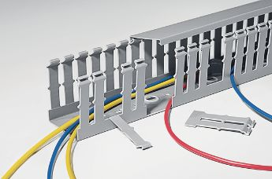
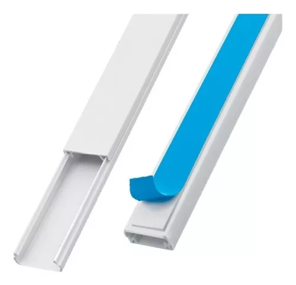
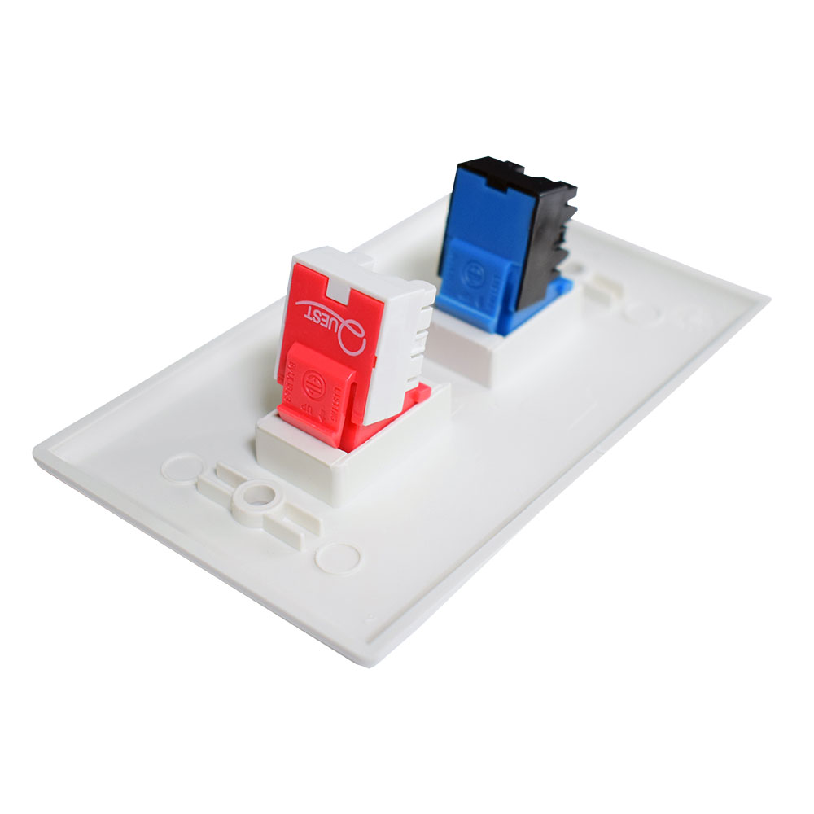
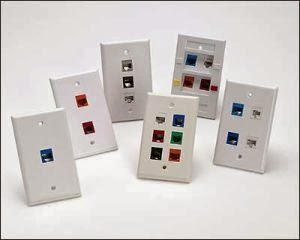
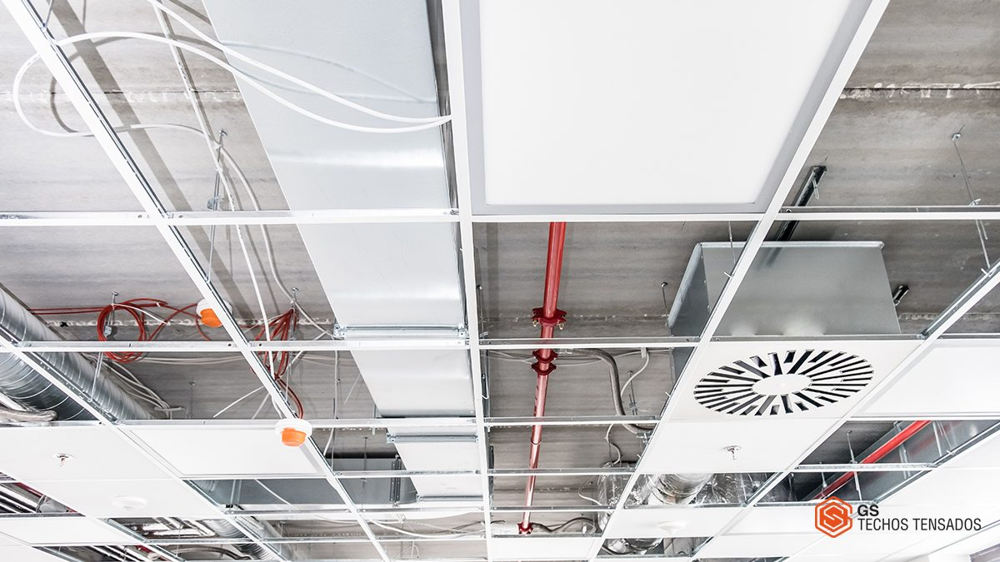
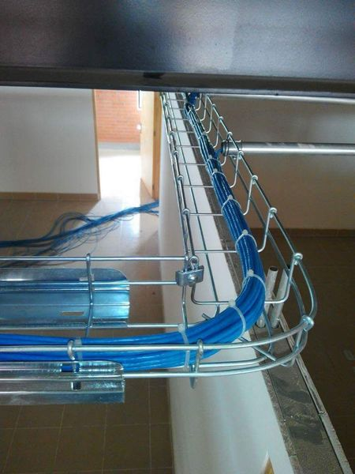
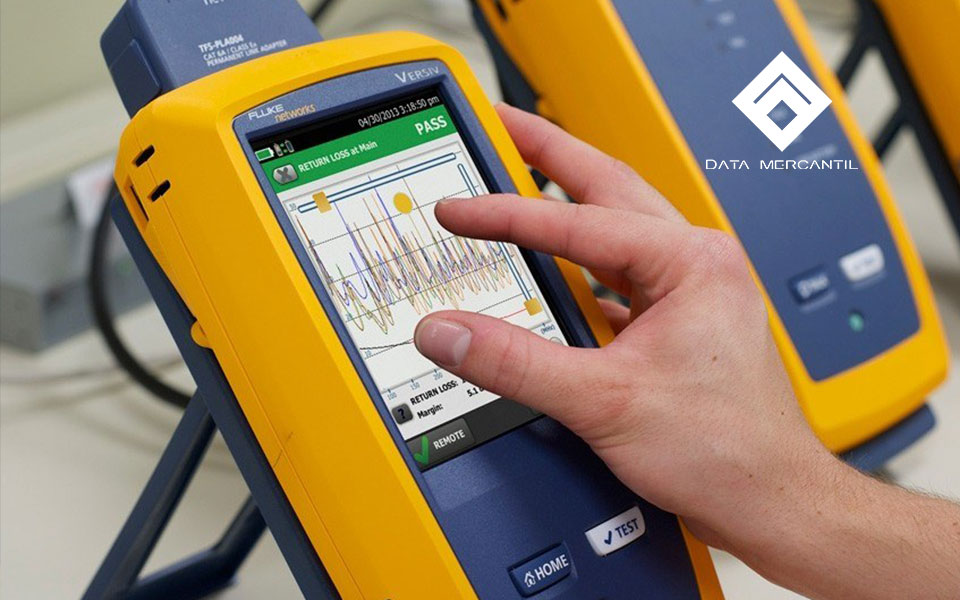
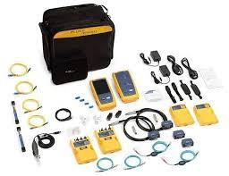
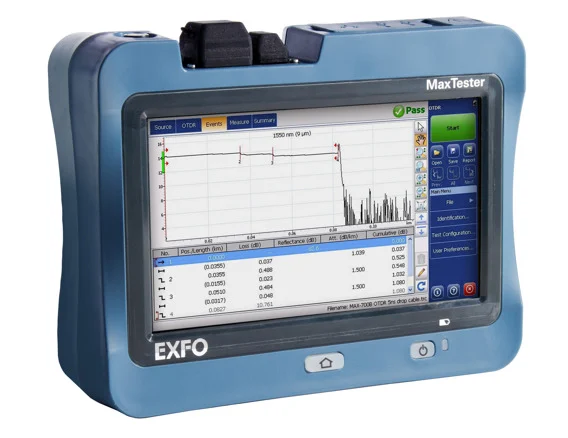

# MiPagina
Taller redes
 
 
## Elementos Constructivos

### Canaletas
Es un canal de PVC que, además de proteger los cables, facilita su distribución. Se utiliza para 
fijar cables a la pared tanto vertical como horizontalmente. Está provisto en toda su longitud 
de marcas para facilitar el corte, además de su acoplamiento con otras canaletas, bien sea en 
forma de T o de L y para la salida de cables. Se compone de un canal, que es la parte que se 
sujeta a la pared y donde van los cables, y una tapa que puede estar integrada o no en el canal.

[ver video sobre canaletas](https://www.youtube.com/embed/VKJ_mSnunog?si=a5_AueMyvx6bbcfh )

###Face Plate
El Face Plate Sencillo FP1 es una tapa de plástico de la caja de toma de datos que se encuentran en 
las paredes o bandejas sobrepuestas y se utilizan para conectar las máquinas de red estructuradas, 
estos faceplate se adaptan a cualquier conector tipo keystone. El Face Plate Sencillo FP1 permite 
opciones multipuerto que nos permite acomodar una gran variedad de configuraciones de red.

### Falso Techo

Un falso techo es un elemento metálico que se instala en la parte superior de una vivienda u oficina. Su objetivo principal es ocultar instalaciones y cableado, pero también desempeña una doble función acústica y decorativa.

[Ver video sobre Falso Techo](https://www.youtube.com/embed/h82Ci1lf4mY?si=YQvSh_Os9qZxR4o_)

### Escalerilla

Una bandeja de cables (España) o escalerilla (México) es un sistema para colocar cables aislados y otros cables (comunicación, red, etcétera) en estructuras de la construcción, como por ejemplo en oficinas, edificios, viviendas, industrias y otros. Permite acceder fácilmente y es útil cuando se añaden nuevos cables o se sustituyen los antiguos.

[Ver video sobre Escalerilla](https://www.youtube.com/embed/XX-voX2DeJA?si=EH_EnN83FJq-VCUb)

### Certificación de un Punto de Cableado Estructurado

La certificación del cableado estructurado es un proceso en el que se compara el rendimiento de transmisión de un sistema de cableado instalado con un estándar determinado, empleando un método definido por el estándar para medir dicho rendimiento.

[Ver video sobre Certificación de un Punto de Cableado Estructurado](https://www.youtube.com/embed/7Ne08sxNkzs?si=tKQDt8XKxiBRjZr8)

### OTDR

Un reflectómetro óptico en el dominio del tiempo (OTDR) es un instrumento de fibra óptica que se emplea para la caracterización, la solución de problemas y el mantenimiento de redes de telecomunicaciones de fibra óptica.

[Ver video sobre OTDR](https://www.youtube.com/embed/gyCqkAdLegw?si=52mBgJBurxHXYAu6)
