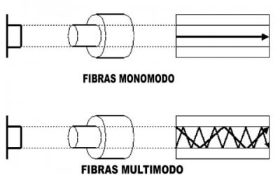

# MiPagina
Taller redes
 
 
## Elementos Constructivos

### Canaletas
Es un canal de PVC que, además de proteger los cables, facilita su distribución. Se utiliza para 
fijar cables a la pared tanto vertical como horizontalmente. Está provisto en toda su longitud 
de marcas para facilitar el corte, además de su acoplamiento con otras canaletas, bien sea en 
forma de T o de L y para la salida de cables. Se compone de un canal, que es la parte que se 
sujeta a la pared y donde van los cables, y una tapa que puede estar integrada o no en el canal.

[ver video sobre canaletas](https://www.youtube.com/embed/VKJ_mSnunog?si=a5_AueMyvx6bbcfh )

### Face Plate
El Face Plate Sencillo FP1 es una tapa de plástico de la caja de toma de datos que se encuentran en 
las paredes o bandejas sobrepuestas y se utilizan para conectar las máquinas de red estructuradas, 
estos faceplate se adaptan a cualquier conector tipo keystone. El Face Plate Sencillo FP1 permite 
opciones multipuerto que nos permite acomodar una gran variedad de configuraciones de red.

### Jack Rj45
La abreviatura RJ45 significa conector registrado-45. Las especificaciones de los conectores 
registrados se refieren a los patrones de cableado de las tomas y no a sus propiedades físicas. 
El número 45 hace referencia al número del registro. Si se quiere ser preciso, hay que llamarlo 
"conector Ethernet RJ45 8P8C". 8P8C significa ocho posiciones / ocho contactos. Se refiere a un tipo
de conector modular. Normalmente se utiliza en el extremo de los cables de interconexión Ethernet. 
Cuando se conecta al extremo de un cable Ethernet, se denomina conector RJ45 8P8C.

### Patch panel
Un panel de conexiones (patch panel), también denominado bahía de rutas, es el elemento encargado de 
recibir todos los cables del cableado estructurado. También se puede definir como paneles donde se 
ubican los puertos de una red o extremos (analógicos o digitales) de una red, normalmente localizados 
en un bastidor o rack de telecomunicaciones. Todas las líneas de entrada y salida de los equipos 
(computadoras, servidores, impresoras, entre otros) tendrán su conexión a uno de estos paneles.

### Rack o gabinete
Los Racks o Gabinetes para servidor son uno de los elementos más importantes de cualquier centro de datos y 
los manejamos en la marca Racks & Cabs. Vienen en muchos modelos diferentes, cada uno de los cuales puede 
tener un diseño general diferente. Si es Rack puede ser de 2 o 4 postes, para piso o pared, Si es Gabinete 
cerrado por paneles laterales y superiores. Sin embargo, no importa qué tipo de bastidor esté presente, 
puede estar seguro de que almacenará varios tipos diferentes de equipos que harán que su empresa funcione 
correctamente. Conocer lo que se incluye en un Rack o Gabinete para servidor puede ayudarlo a obtener el 
máximo beneficio de estos dispositivos.
No es sorprendente que los servidores sean probablemente el elemento más popular que albergará un Rack o 
Gabinete para servidor. Estos pueden ser servidores de Torre que se asemejan a las PC normales o servidores 
blade delgados los cuales ya incluyen los accesorios para el montaje o bien se montan sobre una Charola para 
Servidor. Los servidores son esenciales en la mayoría de las redes, ya que ejecutan varias aplicaciones, 
almacenan datos y realizan funciones críticas para una organización.

### Unidad de medida de espacio dentro de rack o gabinete
A la hora de hablar de tamaños estándar de rack de servidor, el término “rack de 42U” suele ser parte de la 
conversación. Esta dimensión se refiere específicamente a la altura del rack. U, o también RU, son las 
abreviaturas de unidad o unidad rack, respectivamente. Una unidad rack o U es equivalente a 1.75 pulgadas 
o 44.45 milímetros. Así que, un rack de 42U ofrece un espacio vertical para equipos de 73.5 pulgadas.
Otras alturas de los racks de servidor comunes y disponibles incluyen 22U y 27U (conocidos comúnmente como 
medios racks) y gabinetes extragrandes de 48U para las operaciones de centros de datos de alta densidad. 
Además, los racks compactos de montaje en pared se encuentran disponibles en tamaños tan pequeños como 1U, 
un espacio más que suficiente para una aplicación en una oficina pequeña.                
La medida U no solo aplica para la altura del rack de servidor, sino que también se usa para designar la 
altura de los dispositivos de TI que se montarán dentro de los racks. La mayoría de dispositivos (por ejemplo,
los servidores, las unidades de distribución de energía, las unidades de suministro ininterrumpido de energía, 
los conmutadores KVM y los paneles de conexiones) se clasifican con tamaños 3U, 2U, o 1U. Determinar la cantidad 
de dispositivos que pueden colocarse dentro del rack es sencillamente cuestión de sumar los tamaños de cada 
dispositivo y asegurarse de que no superen las dimensiones de altura de su rack. Naturalmente, siempre se querrá 
dejar espacio libre para el crecimiento y el equipo adicional que podría necesitar en el futuro.

### Patch cord
Cable de conexión (patch cord) también llamado cable de red, se usa en redes de computadoras o sistemas
informáticos o electrónicos para conectar un dispositivo electrónico con otro.Está compuesto por cobre 
y cubierto de plástico. Aunque esta definición se usa con mayor frecuencia en el campo de las redes 
informáticas, pueden existir cables de conexión también para otros tipos de comunicaciones electrónicas.

### Fibra optica multimodo y monomodo
La fibra multimodo ofrece una distancia máxima mucho más corta que la fibra monomodo, siendo la opción ideal para aplicaciones 
locales. La fibra monomodo puede llegar a cubrir distancias de 40 km o más, sin dañar la señal, siendo ideal para aplicaciones 
de largo alcance.

### Union de fibra optica por empalme mecanico
El empalme mecánico consiste en la unión de dos fibras ópticas mediante dispositivos mecánicos, asegurando una alineación precisa 
y una conexión estable. A diferencia de los empalmes por fusión, el empalme mecánico no requiere de equipos caros lo que lo 
convierte en una opción rentable y accesible para todos.

### Union fibra optica por funsion termica
Este proceso, conocido como fusión, consiste en fundir los revestimientos de dos fibras, mediante la aplicación de una fuente calorífica, producida por dos electrodos que generan un arco eléctrico, cuando se les aplica una fuente de alta tensión, de 
4000 a 5000 voltios con corriente controlada.

### Conectores para fibra optica
El conector de fibra óptica que viene en varias configuraciones y tipos se considera como un componente importante para el cable de fibra óptica. En general, los diferentes tipos de conectores de cable de fibra se pueden clasificar de acuerdo con las diferentes 
normas como la utilización, el número de fibras, el modo de fibra, el método de transmisión, los medios de transmisión, la longitud 
de arranque, el tipo de pulido y la forma de terminación, etc. Siga este artículo para clasificar los tipos de conectores de fibra.
Los siguientes tipos de conectores de fibra, al igual que los conectores de fibra óptica LC/SC/MTP/MPO/ST, requieren un panel adaptador para su conexión. Los cables de fibra con estos tipos de conectores ópticos suelen utilizarse en centros de datos, salas de telecomunicaciones, redes empresariales, etc.

### piso falso
Un piso falso o también conocido como piso elevado, es un sistema de estructuras que soportan paneles, dichas estructuras se colocan sobre otro piso logrando que haya un espacio entre ellos. El espacio logrado permite el paso de instalaciones eléctricas, cableado estructurado, aire acondicionado, drenajes y tuberías de agua potable mejorando la estética del lugar ya que evita la visibilidad de todo este cableado.
La estructura del piso falso se diseña para soportar cierta cantidad de peso, esto depende de las especificaciones de cada fabricante, pero debe calcularse en base al peso de equipos, personal, muebles y toda la infraestructura que este piso estará cargando.
Algunas de las principales ventajas es que se tiene acceso al subsuelo en cualquier momento para cambiar cableado o hacer reparaciones, hay un ahorro en tiempo y dinero ya que es un sistema fácil de instalar y brinda una protección contra el ruido y la temperatura ya que el aire fluye de mejor manera por el espacio evitando que se caliente.

### Falso Techo

Un falso techo es un elemento metálico que se instala en la parte superior de una vivienda u oficina. Su objetivo principal es ocultar instalaciones y cableado, pero también desempeña una doble función acústica y decorativa.

[Ver video sobre Falso Techo](https://www.youtube.com/embed/h82Ci1lf4mY?si=YQvSh_Os9qZxR4o_)

### Backbone
En el ámbito local, un backbone es una línea o conjunto de líneas a las que las redes de área local se 
conectan para tener conexión de red de área amplia (WAN) o dentro de una red de área local (LAN) para 
abarcar distancias de manera eficiente (por ejemplo, entre los edificios). En internet u otra red de 
área amplia, un backbone es un conjunto de caminos a los que las redes locales o regionales se conectan 
para tener interconexión de larga distancia. Los puntos de conexión son conocidos como nodos de la red o
intercambios de conmutación de datos (DSE) de telecomunicaciones.

### Escalerilla

Una bandeja de cables (España) o escalerilla (México) es un sistema para colocar cables aislados y otros cables (comunicación, red, etcétera) en estructuras de la construcción, como por ejemplo en oficinas, edificios, viviendas, industrias y otros. Permite acceder fácilmente y es útil cuando se añaden nuevos cables o se sustituyen los antiguos.

[Ver video sobre Escalerilla](https://www.youtube.com/embed/XX-voX2DeJA?si=EH_EnN83FJq-VCUb)

### Organizador de cables
Un organizador de cables es un accesorio muy útil para mantener los cables de tus dispositivos electrónicos 
ordenados y libres de enredos. Tú puedes usarlo para agrupar los cables y asegurarte de que estén bien 
organizados. Además, también te ayuda a evitar que los cables se dañen o se enreden entre sí. Un organizador 
de cables puede ser muy práctico tanto en casa como en la oficina, ya que te permite tener un aspecto más 
ordenado y limpio.

### Certificación de un Punto de Cableado Estructurado

La certificación del cableado estructurado es un proceso en el que se compara el rendimiento de transmisión de un sistema de cableado instalado con un estándar determinado, empleando un método definido por el estándar para medir dicho rendimiento.

[Ver video sobre Certificación de un Punto de Cableado Estructurado](https://www.youtube.com/embed/7Ne08sxNkzs?si=tKQDt8XKxiBRjZr8)

### Cables de par trenzado de 8 hilos
En telecomunicaciones, el cable de par trenzado es un tipo de cable que tiene dos conductores eléctricos aislados 
y entrelazados para anular las interferencias de fuentes externas y diafonía de los cables adyacentes. Fue inventado 
por Alexander Graham Bell en 1881.
se clasifican en los tipos UTP y STP. Los cables de par trenzado son un tipo de medio de transmisión que se puede 
utilizar para transmitir señales tanto digitales como analógicas. Es uno de los tipos de cables más populares en uso 
hoy en día.

### OTDR

Un reflectómetro óptico en el dominio del tiempo (OTDR) es un instrumento de fibra óptica que se emplea para la caracterización, la solución de problemas y el mantenimiento de redes de telecomunicaciones de fibra óptica.

[Ver video sobre OTDR](https://www.youtube.com/embed/gyCqkAdLegw?si=52mBgJBurxHXYAu6)

### Conector rj45, identifique el pin 1
El pin 1 corresponde al izquierdo cuando se mira desde arriba (con la lengueta en la parte inferior). En un conector 
hembra (por ejemplo el de una roseta) el pin 1 corresponde al situado mas a la izquierda.
Aunque se suelen unir todos los hilos, para las comunicaciones Ethernet 100BASE-TX sólo se necesitan los pines 1, 2,
3 y 6, usándose los otros para telefonía (el conector RJ-11 encaja dentro del RJ-45, coincidiendo los pines 4 y 5 
con los usados para la transmisión de voz en el RJ-11).

### Ponchadora de presion
Es una herramienta que se compone de unas pinzas que ejercen una gran presión y sirven para presionar fuertemente 
empalmes para los cables eléctricos o zapatas eléctrica.

### Ponchadora de impacto
HT-914B Herramienta de impacto para conectores hembra jack  RJ-45 en cables UTP y FTP. Además, esta diseñada para 
terminales y para cortar alambres con golpe de impacto suave, da facilidad y velocidad en todas sus instalaciones. 
Es durable y permite que las instalaciones de red sean fáciles de implementar.
Adicional, es muy fácil de usar la HT-914B y cuenta con un juego de cuchillas intercambiables que mediante un mecanismo 
de resorte de alto impacto puede insertar cada alambra del UTP o FTP en la correspondiente hendija del jack RJ-45 para su 
pacheo a bastidor de manera precisa y profesional.
Una ponchadora de impacto es una herramienta de punción con carga de resorte utilizado para empujar los hilos entre los 
pins de metal, permitiendo pelar al mismo tiempo el revestimiento del cable. Esto asegura una buena conexión eléctrica del 
cable con los pins que se encuentran dentro del Jack. La herramienta de punción también corta cualquier exceso de alambre.

